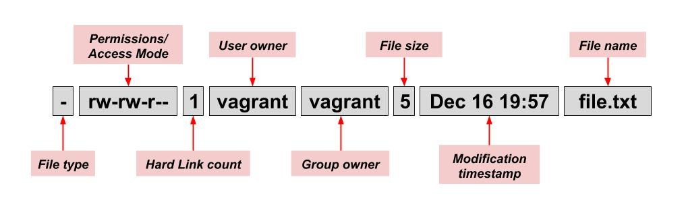
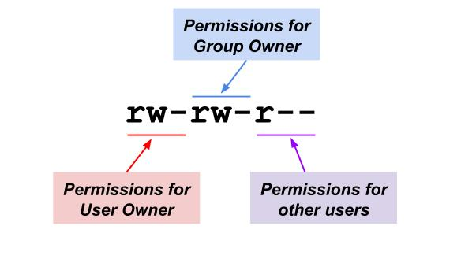
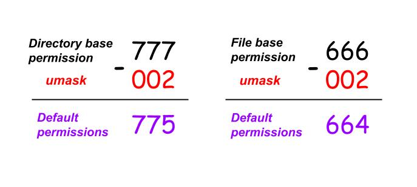

## File permissions

### The basics

_Linux is a **multi-user operating system** which allows more than one user to have access to the system at the same time._ In order for this multi-user design to work properly, there needs to be a method for protecting users' files from each other. This is where _file permissions_ come in to play.

**File permissions** are the "rights" that define what certain users can and cannot do with a file or a directory (which is also a file in Linux). There are three permission types that define user access to files: **read**, **write**, and **execute**:

| Permission type | Effect on a file | Effect on a directory |
|------|------|------|
| **Read**  | Allows the contents of the file to be viewed or read (e.g. using [less](less.md) or [cat](cat.md) commands)  | Allows to list the contents of the directory (i.e. you can run [ls](ls.md) on a directory). **NOTE:** this permission is also required when removing a non-empty directory. |
| **Write** | Allows to modify the contents of the file |  Allows to modify the contents of the directory (e.g. create new files or subdirectories; rename or delete existing files or subdirectories). **NOTE:** it requires the `execute` permission to be also set, otherwise this permission has no effect. |
| **Execute** | Allows to run the file and execute a program or script | Allows to access the directory with a [cd](cd.md) command |

The most common way to view permissions set for a file or directory is by using the [ls](ls.md) command:

```bash
# to view permissions of a regular file
$ ls -l file.txt
-rw-rw-r-- 1 vagrant vagrant 5 Dec 16 19:57 file.txt
# to view permissions of a directory
$ ls -ld testdir
drwxrwxr-x 2 vagrant vagrant 6 Dec 16 19:44 testdir
```

Let's break down and explain this output:



* `File type`: Denotes the type of file. The `d` stands for directory, `–` means a regular file, `l` means a symbolic link, `s` stands for a special file, etc.
* `Permissions` (also called `Access Mode`): This shows the permissions set for a file. We'll further explain this field in more detail below.
* `Hard Link count`: Shows the number of [hard links](links.md) for this file.
* `User owner`: Shows the user who owns the file. This user is often referred to as simply the _owner of the file_. When you create a file, you automatically become the owner of the file, but [the ownership of the file can be changed](#Modyfing-owners).
* `Group owner`: Shows the [user group](groups.md) which owns the file. Only one group can be the owner of a file at a time.
* `File size`: Shows the size of the file in bytes.
* `Modification timestamp`: Shows the [modification timestamp of a file](file-timestamps.md), i.e. the date and time the contents of the file was last modified.
* `Filename`: Shows the name of the file.

Now let's take a closer look at the `permissions` (`access mode`) field. The permissions set for a file are represented by 9 characters:

```
rw-rw-r--
```

Each character specifies a particular permission type:

* `r` : Read permission
* `w` : Write permission
* `x` : Execute permission
* `–` : No permission

Permissions are always printed in the order of `read`, `write` and `execute`, i.e. `rwx`.

You may wonder why there is 9 characters and why some permissions such as read permission (`r`) are repeated multiple times?

The answer is simple. _File permissions are specified for 3 groups of users:_



Where:

* `User Owner`: is a single user which is considered to be the owner of the file.
* `Group Owner`: is a group of users which is considered to be the owner of the file. All users belonging to this group will have the same access permissions for the file.
* `Other users`: this includes all the other users who are not owners of the file but who have access to the system.

Knowing all this, you now should be able to read file permissions from `ls -l` output:

```bash
# to view permissions of a regular file
$ ls -l file.txt
-rw-rw-r-- 1 vagrant vagrant 5 Dec 16 19:57 file.txt
```

This can be read as "the file `file.txt` is owned by user `vagrant` which has read and write permissions to this file. All members of the group `vagrant` have read and write access as well, while everyone else has only read access to this file".

**Note:** root user has super powers and normally, it has read, write and execute permissions to all the files, even if you don’t see it in file permissions.

Consider the following example:

```bash
$ ls -l /tmp/script.sh
-rwxrw----. 1 vagrant vagrant 50 Dec 16 23:38 /tmp/script.sh
```

As we can see from the output, root user is not the owner of the file and nobody except for the owners of this file has permissions to access this file. Let's see if a root user will be able to read, write and execute this file.

```bash
$ whoami  # check the current user
root
$ groups  # make sure root is not part of the vagrant group (which is the owner of the file)
root
$ cat /tmp/script.sh # try reading the file
#!/bin/bash
echo "hello world"
$ echo 'echo "hola mundo"' >> /tmp/script.sh  # try writing to the file
$ /tmp/script.sh  # try executing the file
hello world
hola mundo
```

Often times the **numeric format** is used for file permissions specifications.

In the numeric format, each permission type is represented by an [octal number](https://en.wikipedia.org/wiki/Octal):

* `r` (read) = `4`
* `w` (write) = `2`
* `x` (execute) = `1`
* `–` (no permission) = `0`

You sum up these numbers to represent the entire permission set for one of the three groups of users:

| Octal value | Permission set | Symbolic representation |
|------|------|------|
| `0` | No permissions given | `---` |
| `1` | Execute | `--x` |
| `2` | Write | `-w-` |
| `3` | Execute + Write | `-wx` |
| `4` | Read | `r--` |
| `5` | Read + Execute | `r-x` |
| `6` | Read + Write | `rw-` |
| `7` | Read + Write + Execute | `rwx` |

As the result, when you define file permissions for all three groups of users (user owner, group owner, and others), you end up with a _three digit octal number_.

For example, the following command will show file permissions in both numeric and symbolic formats:

```bash
$ stat -c "%a %A %n" file.txt
664 -rw-rw-r-- file.txt
```

### Default permissions

When you create new files or directories, you normally don't specify their permissions and thus they get a set of **default permissions**. On most distributions, you will see that regular files get a permission of `664` (`rw-rw-r--`), and directories get a permission of `775` (`rwxrwxr-x`):

```bash
$ touch file1.txt
$ mkdir dir1
$ stat -c "%a %A %n" file1.txt
664 -rw-rw-r-- file1.txt
$ stat -c "%a %A %n" dir1
775 drwxrwxr-x dir1
```

But how do you configure these default permissions?

The **file mode creation mask** (also known as **umask**) defines these default permissions. _The **umask** is an octal number that specifies which permission bits should always be turned off when new files or directories are created._

You can view or change the umask for your current shell by using the `umask` command:

```bash
$ umask  # view umask for the current shell in octal format
0002
$ umask -S  # view umask for the current shell in symbolic format
u=rwx,g=rwx,o=rx
```

As you can see, the umask value (`002`) specifies that write permissions should be turned off on new files for the world (i.e. other users). Please, ignore the first `0` in the umask of `0002` for now, it will be explained later in the [special permission bits section](#special-permission-bits).

Now how exactly umask defines default file permissions?

Files have a **base permission** of `666` (or `rw-rw-rw-`) and directories have a base permission of `777` (or `rwxrwxrwx`). When you create a new file or directory, the `umask` is substracted from the corresponding base permission and the result is used for setting permissions for that new file or directory.



To change the umask, simply run `umask` with the desired value in the octal form:

```bash
$ umask 022  # set a new umask
$ umask      # check the current umask value
0022
```

Note that when you change `umask` value this way, it will only be applied for the current shell session. To set a permanent `umask` value for your user, you can add the `umask` command to the end of [~/.bashrc file](shell-and-environment-variables.md).

### Modyfing permissions

When you create a file or directory, you might want to change the [default permissions](#default-permissions). You can do this with the **chmod** (change mode) command.

There are two ways to use `chmod` — the _symbolic mode_ and the _numeric mode_.

#### Using chmod in symbolic mode

The syntax of a `chmod` command is the following:

```bash
chmod [who][+,-,=][permissions] filename
```

where:
* `who` specifies a group of users and can be one of the following values:
    * `u`:	user owner
    * `g`:	group owner
    * `o`:	other users
    * `a`:	all of the above
* `+, -, =`: operators that grant or take away permissions:
    * `+`: grants permissions
    * `-`: takes away permissions
    * `=`: is used to assign an exact set of permissions
* `permissions`: this could be one or a combination permission letters, i.e. `r` (read), `w` (write), `x` (execute).

For example, the following command adds execution permissions to the user owner of the file:

```bash
$ stat -c "%a %A %n" /tmp/script.sh
660 -rw-rw---- /tmp/script.sh
$ chmod u+x /tmp/script.sh
$ stat -c "%a %A %n" /tmp/script.sh
760 -rwxrw---- /tmp/script.sh
```

You can specify multiple permissions by separating them with a comma:

```bash
$ stat -c "%a %A %n" /tmp/script.sh
644 -rw-r--r-- /tmp/script.sh
$ chmod u+x,g+wx /tmp/script.sh
$ stat -c "%a %A %n" /tmp/script.sh
774 -rwxrwxr-- /tmp/script.sh
```

You can also omit a user group specification and specify only the permissions to add or remove. For example:

```bash
$ stat -c "%a %A %n" /tmp/script.sh
644 -rw-r--r-- /tmp/script.sh
$ chmod +x /tmp/script.sh # this is equivalent to running "chmod a+x /tmp/script.sh"
$ stat -c "%a %A %n" /tmp/script.sh
755 -rwxr-xr-x /tmp/script.sh
```

As you can see, this will add the execute permission to all groups of users.

If instead of adding or removing permissions, you want to assign a specific set of permissions to a specific group of user, you can use chmod with the `=` operator. For example, if you want to set the user’s permission to `rw-` and the group’s permission to `r--`, then you can run the following command:

```bash
$ stat -c "%a %A %n" /tmp/script.sh
774 -rwxrwxr-- /tmp/script.sh
$ chmod u=rw,g=r /tmp/script.sh
$ stat -c "%a %A %n" /tmp/script.sh
644 -rw-r--r-- /tmp/script.sh
```

Copying permissions from one group of users to another is also possible:

```bash
$ stat -c "%a %A %n" /tmp/script.sh
644 -rw-r--r-- /tmp/script.sh
$ chmod g=u /tmp/script.sh # grant group owner the same permissions as the user owner
$ stat -c "%a %A %n" /tmp/script.sh
664 -rw-rw-r-- /tmp/script.sh
```

#### Using chmod in numeric mode

Another method for setting permissions is through octal notation.

Here is an example of setting file permissions in numeric format`:

```bash
$ stat -c "%a %A %n" /tmp/script.sh
640 -rw-r----- /tmp/script.sh
$ chmod 755 /tmp/script.sh  # this is equivalent to running "chmod u=rwx,go=rx /tmp/script.sh"
$ stat -c "%a %A %n" /tmp/script.sh
755 -rwxr-xr-x /tmp/script.sh
```

#### Setting file permissions recursively

The **-R** option used with `chmod` applies permissions modifications to a given directory and to all files in it:

```bash
$ ls -l dir2
total 0
-r--r--r-- 1 vagrant vagrant 0 Dec 17 04:29 file1.txt
-rw------- 1 vagrant vagrant 0 Dec 17 04:29 file2.txt
$ ls -ld dir2
drwxr-x--- 2 vagrant vagrant 40 Dec 17 04:29 dir2
$ chmod -R +r dir2
$ ls -l dir2
total 0
-r--r--r-- 1 vagrant vagrant 0 Dec 17 04:29 file1.txt
-rw-r--r-- 1 vagrant vagrant 0 Dec 17 04:29 file2.txt
$ ls -ld dir2
drwxr-xr-- 2 vagrant vagrant 40 Dec 17 04:29 dir2
```

### Modyfing owners

To change the ownership of a file or directory, you need to use the **chown** (change owner) command. It can change both the user owner and the group owner of a file. (There is also the `chgrp` command which only changes the group owner, but `chown` can do it all).

The chown command has the following syntax:

```bash
chown <new_user_name> <filename> # change user owner of a file
chown <new_user_name>:<new_user_group> <filename> # change user and group owners of a file
chown :<new_user_group> <filename> # change group owner of a file
```

**Note:** unlike the `chmod` command which you can run as a regular user for the files you own, you need to be `root` to change ownership information.

Let's see a few examples of changing file ownership information:

```bash
$ ls -l file.txt  # check file owners
-rw-rw-r-- 1 vagrant vagrant 5 Dec 16 19:57 file.txt
$ chown root file.txt  # change user owner to root
chown: changing ownership of ‘file.txt’: Operation not permitted
$ sudo chown root file.txt  # need to run as root
$ ls -l file.txt  # check file owners
-rw-rw-r-- 1 root vagrant 5 Dec 16 19:57 file.txt
$ sudo chown :root file.txt  # change group owner to root
$ ls -l file.txt  # check file owners
-rw-rw-r-- 1 root root 5 Dec 16 19:57 file.txt
$ sudo chown vagrant:vagrant file.txt  # change user and group owners back to vagrant
$ ls -l file.txt  # check file owners
-rw-rw-r-- 1 vagrant vagrant 5 Dec 16 19:57 file.txt
```

Just like `chmod`, `chown` also supports the **-R** flag for recursive change of file ownership:

```bash
$ ls -ld dir2/
drwxr-xr-- 2 vagrant vagrant 40 Dec 17 04:29 dir2/
$ ls -l dir2/
total 0
-r--r--r-- 1 vagrant vagrant 0 Dec 17 04:29 file1.txt
-rw-r--r-- 1 vagrant vagrant 0 Dec 17 04:29 file2.txt
$ sudo chown -R root dir2  # change owner to root user
$ ls -ld dir2/
drwxr-xr-- 2 root vagrant 40 Dec 17 04:29 dir2/
$ ls -l dir2/
total 0
-r--r--r-- 1 root vagrant 0 Dec 17 04:29 file1.txt
-rw-r--r-- 1 root vagrant 0 Dec 17 04:29 file2.txt
```

### Special permission bits

In addition to the read/write/execute file permissions types (also sometimes referred to as **permissions bits**) that we've talked about above, there are a few additional permission bits.

#### Sticky bit

The **sticky bit** is used for shared (between system users) directories. When you need to create a shared directory for users, you certainly want to give users _write permissions (`w`)_ to allow them create and modify files inside the shared directory, but you would also probably want to restrict users from removing or renaming other users' files. This is where the sticky bit comes in handy.

_When you set a sticky bit on a directory, files in that directory can only be removed or renamed by the root user, the directory owner, or the file owner._ Even though the directory permissions may give write permission to all system users, the sticky bit has the final say on this — only root user, the directory owner, or the file owner can remove or rename files in that directory.

You can set sticky bit using symbolic format:

```bash
$ ls -ld /shared-directory
drwxrwxrwx 2 root root 6 Dec 18 04:22 /shared-directory
$ sudo chmod +t /shared-directory  # set sticky bit on a directory
$ ls -ld /shared-directory
drwxrwxrwt 2 root root 6 Dec 18 04:22 /shared-directory
```

As you can see from the output, in the symbolic permissions representation the sticky bit takes place of the execute bit for the other users group.

You can also turn on the sticky bit using the numeric mode by specifying `1` as the forth octal number (which actually comes first in the permissions order) in the file permissions set:

```bash
$ stat -c "%a %A %n" /shared-directory
1777 drwxrwxrwt /shared-directory
$ sudo chmod 777 /shared-directory   # unset sticky bit
$ stat -c "%a %A %n" /shared-directory
777 drwxrwxrwx /shared-directory
$ sudo chmod 1777 /shared-directory  # set the whole permissions set including the sticky bit
$ stat -c "%a %A %n" /shared-directory
1777 drwxrwxrwt /shared-directory
```

Let's see how sticky bit protects user files from each other in a shared directory:

```bash
$ whoami
vagrant
$ stat -c "%a %A %n" /shared-directory  # check diretory permissions
1777 drwxrwxrwt /shared-directory
$ ls -l /shared-directory/  # list contents of a directory
-rw-rw-rw- 1 test-user test-user 12 Dec 18 04:49 test-user-file.txt
$ rm /shared-directory/test-user-file.txt  # try to remove another user's file
rm: cannot remove ‘/shared-directory/test-user-file.txt’: Operation not permitted
$ mv /shared-directory/test-user-file.txt /shared-directory/test-user-file1.txt  # try to rename another user's file
mv: cannot move ‘/shared-directory/test-user-file.txt’ to ‘/shared-directory/test-user-file1.txt’: Operation not permitted
$ mv /shared-directory/test-user-file.txt /tmp/  # try to move another user's file
mv: cannot move ‘/shared-directory/test-user-file.txt’ to ‘/tmp/test-user-file.txt’: Operation not permitted
$ echo "hello world" > /shared-directory/test-user-file.txt  # try to write to another user's file
$ ls -l /shared-directory  # writing was successful because it is regulated by that file permissions and not by a sticky bit set on directory
-rw-rw-rw- 1 test-user test-user 12 Dec 18 04:51 test-user-file.txt
$ touch /shared-directory/vagrant-file.txt  # try to create my own file
```

A practical example of using a sticky bit is the **/tmp directory**, where programs (running under different users) can store temporary files. To prevent accidental deletion of other user’s files, Linux distros set the sticky bit on `/tmp`:

```bash
$ stat -c "%a %A %n" /tmp
1777 drwxrwxrwt /tmp
```

#### Setuid and Setgid bits

_When the **setuid** bit is set on a file, it does not run with the privileges of the user who launched it, but with that of the file owner instead._ 

So, for example, if an executable has the setuid bit set and it's owned by root, when launched by a normal user, it will run with root privileges.

If you have ever wondered how commands like [su](su.md) and [sudo](sudo.md) work, the answer lies in the `setuid` bit.

You will find that su/sudo has the setuid bit set (notice the `s` in the access mode field) and is owned by root. Thus, when you run su/sudo it runs as root and launches any programs that you want as root:

```bash
$ stat -c "%a %A %n" $(which sudo)
4111 ---s--x--x /usr/bin/sudo
$ stat -c "%a %A %n" $(which su)
4755 -rwsr-xr-x /usr/bin/su
```

You can set the `setuid` bit on a file using numeric or symbolic format:

```bash
$ stat -c "%a %A %n" script.sh
664 -rw-rw-r-- script.sh
$ chmod u+s script.sh  # set setuid bit using symbolic format
$ stat -c "%a %A %n" script.sh
4664 -rwSrw-r-- script.sh  # capital S implies that executable bit is not set
$ ls -l script.sh
-rwSrw-r-- 1 vagrant vagrant 0 Dec 18 05:42 script.sh
$ chmod +x script.sh
$ stat -c "%a %A %n" script.sh
4775 -rwsrwxr-x script.sh  # lowercase s implies that executable bit is set
$ chmod 755 script.sh  # unset setuid bit
$ stat -c "%a %A %n" script.sh
755 -rwxr-xr-x script.sh
$ chmod 4755 script.sh  # set setuid bit using numeric format
$ stat -c "%a %A %n" script.sh
4755 -rwsr-xr-x script.sh
```

**NOTE:** [setuid bit is ignored for all interpreted executables](https://unix.stackexchange.com/questions/364/allow-setuid-on-shell-scripts).

The **setgid** bit works in a way similar to `setuid`, i.e. when a file with `setgid` is executed, instead of running with the privileges of the group of the user who started it, it runs with those of the group which owns the file.

When `setgid` is set, you will see `s` letter in place of execute permission bit for group owners. The `setgid` has an octal value of `2`:

```bash
$ stat -c "%a %A %n" /tmp/test-user-directory
2777 drwxrwsrwx /tmp/test-user-directory
```

If you want to turn on `setgid` bit on a file, you can run the following command:

```bash
$ chmod g+s <path-to-file>
```

**Note:** unlike `setuid` which has no effect on directories, the `setgid` does have interesting effects when set on directories:

* When a user creates new files or subdirectories inside this directory, they inherit the owner group. This differs from the default behaviour, where newly created files are owned by the user’s default group.
* Any new subdirectories will also have the `setgid` bit set. However, any files that were present before the `setgid` bit was set will remain unaffected.

Here is a few examples that demonstrate the effects of `setgid` on a directory:

```bash
$ whoami
vagrant
$ ls -ld /tmp/test-user-directory  # check owners and permissions
drwxrwsrwx 2 test-user test-user 6 Dec 18 05:54 /tmp/test-user-directory/
$ touch /tmp/test-user-directory/file.txt  # create a file
$ ls -l /tmp/test-user-directory/file.txt  # check owners and permissions
-rw-rw-r-- 1 vagrant test-user 0 Dec 18 05:56 /tmp/test-user-directory/file.txt
$ mkdir /tmp/test-user-directory/dir1  # create a directory
$ ls -ld /tmp/test-user-directory/dir1  # check owners and permissions
drwxrwsr-x 2 vagrant test-user 6 Dec 18 05:56 /tmp/test-user-directory/dir1
```

### ACL

Traditional UNIX file permissions scheme provides `read`, `write`, and `execute` permissions for the three classes of users: `user owner`, `group owner`, and `other users`.

For most applications, this scheme is sufficient. However, some applications need finer control over the permissions granted to specific users and groups.

For example, if you wanted everyone in a group to be able to _read_ a file, you would simply make that group the group owner of the file and give it read permissions. Now, assume you wanted only one user in the group to also be able to _write_ to that file. This is where `ACL` comes in.

**Access control list** (**ACL**) provides an additional, _more flexible_ permission mechanism for file systems.
Whereas traditionally we were pretty much restricted to specifying permissions for a _single user_ and a _single group_, `ACL` provides the ability to give any number of different users and groups different access to a given file.

**Warning note:** although `ACL` allows to specify more fine-grained restricted access to a file, in most cases you can achieve what you want with traditional file permissions and avoid introducing unnecessary complexity.

#### Prerequisites

To work with `ACL`, you will need to meet the following prerequisites.

First, the `acl package` needs to be installed. The `acl package` is a dependency of [systemd](systemd.md), so if your distro uses `systemd`, it should already be installed.

```bash
$ yum info acl -q
Installed Packages
Name        : acl
Arch        : x86_64
Version     : 2.2.51
Release     : 14.el7
Size        : 197 k
Repo        : installed
From repo   : anaconda
Summary     : Access control list utilities
URL         : http://acl.bestbits.at/
License     : GPLv2+
Description : This package contains the getfacl and setfacl utilities needed for
            : manipulating access control lists.
```

Second, the [filesystem needs to be mounted with ACL support enabled](https://wiki.archlinux.org/index.php/Access_Control_Lists#Enabling_ACL). Note that [some filesystems may have the ACL enabled by default]((https://unix.stackexchange.com/questions/411922/how-do-i-mount-an-xfs-partition-enabling-acl)).

#### Setting ACLs

The **setfacl** command is used to set `acl` on files. Use `-m` (`--modify`) option to modify the `ACL` of a file:

```bash
$ setfacl -m <rules> <file>
```

Where access control `rules`  must be specified in the following formats. Multiple rules can be specified in the same command if they are separated by commas:

* `u:uid:perms` - sets the `ACL` for a user. The user may be any valid user on the system. The user name or UID may be specified in place of `uid`. If `uid` is not specified (i.e. `u::perms`), it will change the permissions of the user who owns the file.
* `g:gid:perms` - sets the ACL for a group. The group may be any valid group on the system. The group name or GID may be specified in place of `gid`. Permissions of the owning group will be changed if `gid` is empty (i.e. `g::perms`).
* `m:perms` - sets the **effective rights mask**. The effective mask is used to restrict action(s) for all users and groups, that are defined in `ACL` (the standard file permissions are not affected by the mask, just the permissions granted by using `ACL`). It means, for example, that you can prevent all users from writing to a file by [setting the effective mask r-x](https://www.calculate-linux.org/main/en/setting_filesystem_acl) (see also explanation [here](http://www.informit.com/articles/article.aspx?p=725218&seqNum=5) for more info).
* `o:perms` - sets the ACL for other users.

The `perms` field is a combination of characters that indicate the permissions: read (`r`), write (`w`), execute (`x`), execute only if the file is a directory or already has execute permission for some user (`X`). Alternatively, the `perms` field can be an octal number (`0-7`).

For example, the following command will give read permissions to the `test-user` by setting `ACL` on the file:

```bash
$ whoami
test-user
$ ls -l /tmp/file.txt
-rw-rw---- 1 vagrant vagrant 12 Dec 22 04:48 /tmp/file.txt  # notice that test-user doesn't have any permissions
$ cat /tmp/file.txt  # try reading the file
cat: /tmp/file.txt: Permission denied
$ sudo setfacl -m u:test-user:r /tmp/file.txt  # give read permissions to the test-user using ACL
$ ls -l /tmp/file.txt
-rw-rw----+ 1 vagrant vagrant 12 Dec 22 04:48 /tmp/file.txt  # this still doesn't show any permissions for test-user
$ cat /tmp/file.txt  # try reading the file
hello world
```

Did you notice that when we ran the `ls -l` command after we set the `ACL` for the file, at the end of the permissions the `+` character appeared:

```bash
$ ls -l /tmp/file.txt
-rw-rw----+ 1 vagrant vagrant 12 Dec 22 04:48 /tmp/file.txt  # this still doesn't show any permissions for test-user
```

The `+` sign indicates that ACL is set for this file, and we need to check the `ACL` rules if we want to see a full picture of all the access permissions set for the file. To view the `ACL` rules set for the file, use the **getfacl** command:

```bash
$ getfacl /tmp/file.txt
getfacl: Removing leading '/' from absolute path names
# file: tmp/file.txt
# owner: vagrant
# group: vagrant
user::rw-
user:test-user:r--
group::rw-
mask::rw-
other::---
```

And here we can see that the `test-user` was indeed given a read permission (`user:test-user:r--`).

_If a file or directory already has an ACL, and the `setfacl` command is used, the additional rules are added to the existing ACL or the existing rule is modified._

In particular this means that we could give access to another user (`test-user2`) by adding rules to the existing ACL:

```bash
$ whoami
test-user2
$ getfacl /tmp/file.txt  # check file permissions and ACL
getfacl: Removing leading '/' from absolute path names
# file: tmp/file.txt
# owner: vagrant
# group: vagrant
user::rw-
user:test-user:r--
group::rw-
mask::rw-
other::---
$ cat /tmp/file.txt  # try reading the file
cat: /tmp/file.txt: Permission denied
$ sudo setfacl -m u:test-user2:rw /tmp/file.txt  # give read permissions to the test-user2 using ACL
$ cat /tmp/file.txt  # try reading the file again
hello world
$ getfacl /tmp/file.txt  # check file permissions and ACL
getfacl: Removing leading '/' from absolute path names
# file: tmp/file.txt
# owner: vagrant
# group: vagrant
user::rw-
user:test-user:r--
user:test-user2:rw-
group::rw-
mask::rw-
other::---
```

#### Removing ACLs

You can remove a specific ACL rule using the `-x` option:

```bash
$ getfacl /tmp/file.txt
getfacl: Removing leading '/' from absolute path names
# file: tmp/file.txt
# owner: vagrant
# group: vagrant
user::rw-
user:test-user:r--
user:test-user2:rw-
group::rw-
mask::rw-
other::---
$ sudo setfacl -x user:test-user2 /tmp/file.txt
$ getfacl /tmp/file.txt
getfacl: Removing leading '/' from absolute path names
# file: tmp/file.txt
# owner: vagrant
# group: vagrant
user::rw-
user:test-user:r--
group::rw-
mask::rw-
other::---
```

If you want to remove all ACL rules, then you can use the `-b` option:

```bash
$ getfacl /tmp/file.txt
getfacl: Removing leading '/' from absolute path names
# file: tmp/file.txt
# owner: vagrant
# group: vagrant
user::rw-
user:test-user:r--
group::rw-
mask::rw-
other::---
$ sudo setfacl -b /tmp/file.txt
$ getfacl /tmp/file.txt
getfacl: Removing leading '/' from absolute path names
# file: tmp/file.txt
# owner: vagrant
# group: vagrant
user::rw-
group::rw-
other::---
```

#### Default ACLs

**Default ACLs** are only created on directories. When you set default ACLs on a directory, any files created within that directory will also have that default ACL assigned to them automatically:

```bash
$ getfacl /tmp/testdir
getfacl: Removing leading '/' from absolute path names
# file: tmp/testdir
# owner: vagrant
# group: vagrant
user::rwx
group::rwx
other::---
$ setfacl -dm u:test-user:rx /tmp/testdir
$ getfacl /tmp/testdir
getfacl: Removing leading '/' from absolute path names
# file: tmp/testdir
# owner: vagrant
# group: vagrant
user::rwx
group::rwx
mask::rwx
other::---
default:user::rwx
default:user:test-user:r-x
default:group::rwx
default:mask::rwx
default:other::---
$ touch /tmp/testdir/file.txt
$ getfacl /tmp/testdir/file.txt
getfacl: Removing leading '/' from absolute path names
# file: tmp/testdir/file.txt
# owner: vagrant
# group: vagrant
user::rw-
user:test-user:r-x		#effective:r--
group::rwx			#effective:rw-
mask::rw-
other::---
```


### Resources used to create this document:

* https://www.linode.com/docs/tools-reference/linux-users-and-groups/
* https://wiki.archlinux.org/index.php/File_permissions_and_attributes
* https://www.booleanworld.com/introduction-linux-file-permissions/
* https://linuxhandbook.com/linux-file-permissions/
* https://www.linode.com/docs/tools-reference/tools/modify-file-permissions-with-chmod/
* https://linuxconfig.org/how-to-use-special-permissions-the-setuid-setgid-and-sticky-bits
* https://docs.oracle.com/cd/E19455-01/805-7229/6j6q8svdb/index.html
* https://wiki.archlinux.org/index.php/Access_Control_Lists
* https://access.redhat.com/documentation/en-us/red_hat_enterprise_linux/6/html/storage_administration_guide/acls-setting
* man setfacl
* https://www.calculate-linux.org/main/en/setting_filesystem_acl
* https://www.thegeekdiary.com/unix-linux-access-control-lists-acls-basics/
