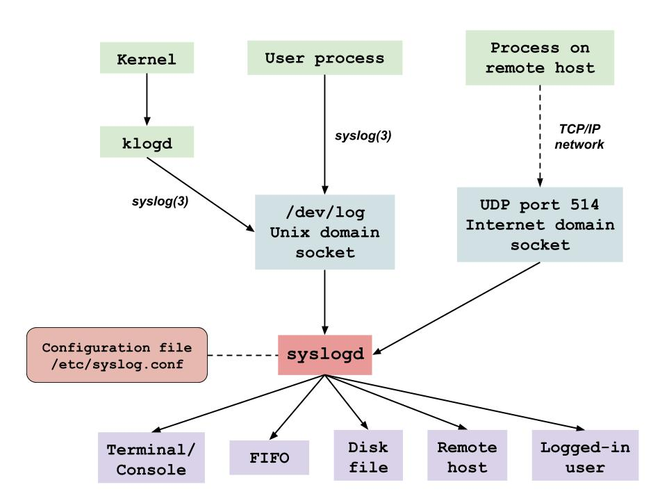
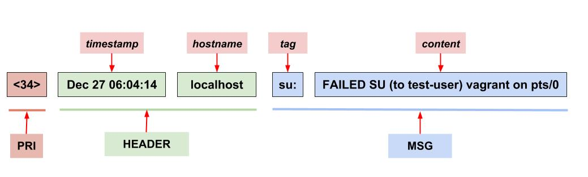

## Logging in Linux

System administrators have to deal with lots of different kinds of messages from a plethora of different application and operating system components. For example, an HTTP server might report every connection it gets. The kernel might report hardware failures on a disk drive. A DNS server might report usage statistics at regular intervals. Cron jobs might report errors on failed executions.

To help with managing all these log messages, Linux has a couple of logging facilities which we'll talk about in this post.

### syslog

The `syslog` facility provides a single, _centralized_ logging facility that can be used to
log messages by all applications and system components (e.g. kernel, networking). Here is a bit simplified overview of the original syslog facility  taken from [The Linux Programming Interface](https://www.amazon.com/Linux-Programming-Interface-System-Handbook/dp/1593272200) book:



The syslog facility has two principal components: the **syslog daemon** (in this case, it's `syslogd`, but there are other alternatives as will see later) and the **syslog(3) library function**.

At the heart of the logging mechanism is the **syslog daemon**. It accepts log messages from two different
sources: a Unix domain socket (**/dev/log**) to which local processes write their logs, and (if enabled) an Internet domain socket (port `514`), which holds messages sent across a TCP/IP network.

Each message processed by a `syslog daemon` has a number of _attributes_, including a
**facility**, which specifies the type of program generating the message, and a **severity** (also called **log level**), which specifies the severity (priority) of the message (e.g. warning, critical, info, etc.). A `syslog daemon` examines
the `facility` and `severity` of each message, and then passes it along to any of several
possible destinations which are defined by an associated configuration file (e.g. `/etc/syslog.conf`). Possible destinations include a terminal or virtual console, a disk file, a
FIFO, one or more (or all) logged-in users, or a process (typically another syslog
daemon) on another system connected via a TCP/IP network (sending the message
to a process on another system is useful for reducing administrative overhead by consolidating messages from multiple systems to a single location). A single message may
be sent to multiple destinations (or none at all), and messages with different combinations of `facility` and `severity` can be sent to different destinations.

As you can see, the syslog logging facility provides a centralized mechanism of aggregation and management of log messages generated by local processes and different operating system components. By default, syslog daemon routes log messages it receives to various files inside `/var/log` directory (e.g. `/var/log/cron`, `/var/log/messages`, etc.) based on the type of program (i.e. `facility`) that sent the message to syslog and the severity (level) of that message.

Note that messages written to the syslog socket (`/dev/log`) should be in a [specific format](#syslog-message-format) so that `syslog daemon` could recognize, classify and route them properly. The **syslog() library function** available in most programming languages can be used by any process to send a message to the syslog daemon. The function uses its supplied arguments to construct a message in the `syslog format` that is then placed on the `/dev/log` socket for reading by `syslog daemon`.

The syslog project started in 1980. Its simplified original implementation was illustrated on the picture above. But syslog project has evolved over time. New syslog daemon implementations such as **syslog-ng** (1998) and **rsyslogd** (2004) came around. New syslog daemons provided features that the original `syslogd` daemon was missng such as support for `TCP`, additional log destinations (e.g. various databases and message queues) and log message mutations (e.g. changing output format, adding additional fields); eliminated the need for `klogd` deamon (e.g. `rsylogd` doesn't use it). Even though newer syslog daemons are now more commonly used, the original idea behind how syslog facility works overall (as we described above) remained pretty much the same.

Most modern Linux distributions nowadays run `rsyslogd` as their default syslog daemon. Therefore further in this post we will be talking about `rsyslogd` and its configuration, rather than the original `syslogd` daemon.

### syslog message format

For a log message sent to `/dev/log` to be processed successfullu by a syslog daemon, it has to be in a specific format (**syslog format**) that a syslog daemon can understand.

This is when things may become a bit confusing as there are [two major formats](https://sematext.com/blog/what-is-syslog-daemons-message-formats-and-protocols/#syslog-message-formats-2) for syslog messages:

* the original BSD format ([RFC3164](https://tools.ietf.org/html/rfc3164))
* the "new" format ([RFC5424](https://tools.ietf.org/html/rfc5424))

Let's take a look at the **original format** (the new format is kind of similar and you can read more about it [here](https://sematext.com/blog/what-is-syslog-daemons-message-formats-and-protocols/#rfc5424-aka-the-new-format-4)). Below you can see an example of a syslog message in the original format:



**NOTE:** the picture shows the format in which applications and OS components should log to `/dev/log` for syslog daemon to be able to process log messages. This is not the format in which the messages will end up being written to a log file. If your syslog daemon is configured to funnel messages to local files without any transformations (remember the daemon is capable of changing fields and format of the message), you can see something like this in your log files (note that the `PRI` part is missing):

```bash
$ fgrep -i 'failed su' /var/log/messages
Dec 27 06:04:14 localhost su: FAILED SU (to test-user) vagrant on pts/0
```

On the picture we see that the syslog message consists of 3 parts. Let's take a closer look at each one of them.

#### PRI

**PRI** (stands for `priority`) is a number enclosed in angle brackets. This number represents both the `facility` and `severity` (aslo called `log level`) attributes of a syslog message which we've already mentioned earlier.

**Facility** identifies an application or operating system component that submitted the message. Facility is represented by a _numeric code_ in log messages, whereas in syslog daemon configuration file one of the _file abbreviations_ is used to refer to a facility:

| Numeric code | File abbreviation | Facility |
|------|------|------|
| `0` | `kern` | kernel messages |
| `1` | `user` | user-level messages |
| `2` | `mail` | mail system |
| `3` | `daemon` | system daemons |
| `4` | `auth` | security/authorization messages |
| `5` | `syslog` | messages generated internally by syslog daemon |
| `6` | `lpr` | line printer subsystem |
| `7` | `news` | network news subsystem |
| `8` | `uucp` | UUCP subsystem |
| `9` | `cron` | clock daemon (cron/at) |
| `10` | `authpriv` | security/authorization messages |
| `11` | `ftp` | FTP daemon |
| `12` | `ntp` | NTP subsystem |
| `13` | `security` | log audit |
| `14` | `console` | log alert |
| `15`| `cron` | clock daemon (cron/at) |
| `16` | `local0` | local use 0 |
| `17` | `local1` | local use 1 |
| `18` | `local2` | local use 2 |
| `19` | `local3` | local use 3 |
| `20` | `local4` | local use 4 |
| `21` | `local5` | local use 5 |
| `22` | `local6` | local use 6 |
| `23` | `local7` | local use 7 |

**Severity** (also called `log level` or simply `level`) indicates the level of importance of a log message. Severities range from `0` (Emergency) to `7` (Debug):

| Numeric code | File abbreviation | Severity |
|------|------|------|
| `0` | `emerg` | Emergency: system is unusable |
| `1` | `alert` | Alert: action must be taken immediately |
| `2` | `crit` | Critical: critical conditions |
| `3` | `err` | Error: error conditions |
| `4` | `warning` | Warning: warning conditions |
| `5` | `notice` | Notice: normal but significant condition |
| `6` | `info` | Informational: informational messages |
| `7` | `debug` | Debug: debug-level messages |

The `priority` is calculated by using the following formula:

```
priority =  facility * 8  + severity
```

This means, for example, that a kernel message (facility=0) with a severity of emergency (severity=0) would have a priority value of `0`, and a "local use 4" message (facility=20) with a severity of notice (severity=5) would have a priority value of `165`. In the `PRI` part of a syslog message, these values would be placed between the angle brackets, i.e. `<0>` and `<165>` respectively.

Combining in itself `facility` and `severity`, `priority` acts as identification information for log messages. We will later see how we can use this information to configure syslog daemon to route various different messages to different destinations.

#### HEADER

[The HEADER part of a syslog message contains the two following fields](https://tools.ietf.org/html/rfc3164#section-4.1.2):

* `timestamp` is the date and time at which the message was generated. Be warned, that this timestamp is picked up from the system time and if the system time is not correct, you might get a packet with totally incorrect timestamp.
* `hostname`: hostname or IP address of the host from which the message was originated.

#### MSG

[The MSG part has two fields](https://tools.ietf.org/html/rfc3164#section-4.1.3):

* `tag` is the name of the program or process that generated the process. Sometimes the PID is also specified along with the name (e.g. `su[1234]:`). The tag typically ends in a colon (`:`), but it may also end with a left square bracket (`[`) or a space.
* `content` contains the details of the message. This has traditionally been a free-form message that gives some detailed information about the event.

### Beware: syslog is an overloaded term

The word `syslog` is an overloaded term and is often used in short to refer to one of these:

* `syslog daemon` — a program to receive, process, and send syslog messages. It can send syslog messages remotely to a centralized server or write it to a local file. Common examples include rsyslogd and syslog-ng. In this usage, people will often say _"sending to syslog"_, meaning sending syslog messages to the syslog daemon.
* `syslog protocol` — a transport protocol which specifies how logs can be sent over a network and a [data format definition for syslog messages](#syslog-message-format). It’s officially defined in [RFC5424](https://tools.ietf.org/html/rfc5424). The standard ports are 514 for plaintext logs and 6514 for encrypted logs. In this usage, people will often say _"sending over syslog"_, meaning sending log messages over syslog protocol.
* `syslog messages` — log messages or events in the [syslog format]((#syslog-message-format)). In this usage, people will often say _"sending syslog"_, meaning sending log messages in syslog format.

### rsyslog

As we've already mentioned, most modern Linux distros use `rsyslogd` as their default syslog daemon.

The `/etc/rsyslog.conf`, configuration file controls the operation of the `rsyslogd` daemon. There are a lot of configuration options for rsyslog that's why below I will only highlight the most basic and important facts (please refer to [rsyslog documentation](https://www.rsyslog.com/doc/v8-stable/configuration/index.html) for more information).

`rsyslog` has a modular design and supports many different inputs (e.g. apache kafka, klog, etc.) and outputs (e.g. myslq, mongodb, apache kafka, etc.) via [modules](https://www.rsyslog.com/doc/v8-stable/configuration/modules/index.html):

```bash
$ fgrep MODULES /etc/rsyslog.conf -A4
#### MODULES ####
# The imjournal module bellow is now used as a message source instead of imuxsock.
$ModLoad imuxsock # provides support for local system logging (e.g. via logger command)
$ModLoad imjournal # provides access to the systemd journal
```

**Rules** form the basis of rsyslog message processing. They define a mapping of various syslog messages rsyslogd daemon receives to different destinations. Rules have the following general form:

```
facility.severity    action
```

Together, the [facility](#pri) and [severity](#pri) are referred to as the **selector**, since they select the
messages to which the rule applies. The **action** specifies where to send the messages matching this `selector`. White space(s) separates the selector and the action parts of a rule. The following are examples of rules:

```
kern.*                                                  /dev/console
*.info;mail.none;authpriv.none;cron.none                /var/log/messages
authpriv.*                                              /var/log/secure
```

Let's break these rules down:

* The first rule says to write kernel messages of all severity levels (`*`) to the /dev/console.
* The second rule says that messages from all facilities (`*`) with a level of `info` or higher should be written to /var/log/messages file. Specifying mail, authpriv and cron facilities with a severity of `none` allows to exclude them from this rule.
* The third rule says to catch all messages (`*`) from the authpriv facility and write them to `/var/log/secure` file.

The new versions of `rsyslog` also support grouping of rules into [rulesets](https://www.rsyslog.com/doc/v8-stable/configuration/basic_structure.html#rulesets-and-rules).

_Other important notes about rsyslog and its configuration:_

1. The configuration for `rsyslog` can also be imported from other custom file locations. By default, `rsyslog` also reads configuration files in `/etc/rsyslog.d` directory:

    ```bash
    $ fgrep -r '$IncludeConfig' /etc/rsyslog.conf -B1
    # Include all config files in /etc/rsyslog.d/
    $IncludeConfig /etc/rsyslog.d/*.conf
    ```
2. `rsyslog` uses the original BSD syslog protocol ([RFC3164](https://tools.ietf.org/html/rfc3164)) which we described [above](#syslog-message-format), but it also includes support for the new syslog protocol ([RFC5424](https://tools.ietf.org/html/rfc5424)).

### logger utility

The **logger** command line utility provides an easy way to write to syslog from shell.

For example, on my system the first rule in my `/etc/rsyslog.conf` file is the following:

```
*.info;mail.none;authpriv.none;cron.none                /var/log/messages
```

This configuration means that syslog messages from all the facilities (except for main, authpriv, and cron) will be written to `/var/log/messages` file. Let's see if I can log to that file with `logger` command:

```bash
$ logger Test1
$ tail -1 /var/log/messages
Dec 29 06:10:03 host01 vagrant: Test1
```

It worked!

The `logger` also allows to specify [priority](#pri) which if you recall is a combination of [facility](#pri) and [severity](#pri). The following command will send a message to syslog daemon on behalf of a cron facility:

```bash
$ fgrep 'cron.' /etc/rsyslog.conf  # check where cron messages get written
*.info;mail.none;authpriv.none;cron.none                /var/log/messages
cron.*                                                  /var/log/cron
$ logger -p cron.info Test2
$ tail -1 /var/log/cron
Dec 29 06:18:01 host01 vagrant: Test2
```

Notice that in the line that gets written to the log file, in place of the [tag](#syslog-message-format) (which identifies the process that writes to syslog) we have a name of a user (`vagrant`) who has run the logger command. You can overwrite this tag with the `-t` option:

```bash
$ logger -p cron.info -t test-program Test3
$ tail -1 /var/log/cron
Dec 29 06:26:37 host01 test-program: Test3
```

The logger command is not only useful for debugging the syslog configuration, but it's also often used in scripts (e.g. cron jobs) to track the completion of important tasks. For example:

```bash
$ cat /etc/cron.daily/logrotate
#!/bin/sh

/usr/sbin/logrotate -s /var/lib/logrotate/logrotate.status /etc/logrotate.conf
EXITVALUE=$?
if [ $EXITVALUE != 0 ]; then
    /usr/bin/logger -t logrotate "ALERT exited abnormally with [$EXITVALUE]"
fi
exit 0
```

### Systemd journal

**Journal** is another solution to centralized logging in Linux. It's part of the [systemd](systemd.md) package and known as `systemd-journald` service (or simply `journald`). It is running by default on systems that use systemd init system:

```bash
$ systemctl status systemd-journald
● systemd-journald.service - Journal Service
   Loaded: loaded (/usr/lib/systemd/system/systemd-journald.service; static; vendor preset: disabled)
   Active: active (running) since Sat 2018-12-29 19:33:27 UTC; 4h 23min ago
```

_`Journal` is a completely different logging facility than `syslog`, so don't confuse it with another syslog daemon because it's not. In fact, we will later see that both journal and syslog often coexist on systems use systemd._

So what is journal and how is it different from syslog?

Journal is a system service that aims to collect _all_ system and application logs and centralize their management. Journal captures logs from the following sources:

1. Kernel log messages
2. Syslog messages
3. Structured system log messages via the [native Journal API](http://0pointer.de/blog/projects/journal-submit.html)
4. **Standard output and standard error of system services**

If the first 2 types of logs we've seen to be collected by a syslog daemon, we didn't see a syslog to have an API or the ability to collect stdout/stderr of system services.

The last feature is especially important, that's why I put it in bold. The systemd service manager invokes all service processes with standard output and standard error connected to the journal by default. This basically means that if a service/application is managed by [systemd](systemd.md) and that service/application is writing its logs to stdout and stderr, then journal will automatically collect all its logs.

Another interesting feature of journal is how it stores logs. **Journal stores logs in a binary format.** Storing the log data in a binary format means that the data can be displayed in arbitrary output formats depending on what you need at the moment. For instance, for daily log management you may be used to viewing the logs in the standard syslog format, but if you decide to graph service interruptions later on, you can output each entry as a JSON object to make it consumable to your graphing service. Since the data is not written to disk in plain text, no conversion is needed when you need a different on-demand format.

By default, the journal stores log data in `/run/log/journal/`. Because the log data is stored in a binary format, it's not readable by humans with tools like [less](less.md) or [cat](cat.md). The log data is viewed by using a special utility called **journalctl**:

```bash
$ journalctl -n 2  # see the last 2 lines of all stored logs
-- Logs begin at Sun 2018-12-30 18:41:18 UTC, end at Sun 2018-12-30 19:31:46 UTC. --
Dec 30 19:21:01 host01.example.com systemd[1]: Stopping User Slice of root.
Dec 30 19:31:46 host01.example.com sudo[2396]:  vagrant : TTY=pts/0 ; PWD=/home/vagrant ; USER=root ; COMMAND=/bin/bash
```

**Note:** `/run/` is volatile, log data is lost at reboot. Read the [journald man page](http://man7.org/linux/man-pages/man8/systemd-journald.8.html) or answer [here](https://unix.stackexchange.com/a/159390) on how to persist logs collected by journald.

Besides storing logs in binary, **journal implicitly adds structure to all log messages it receives** (P.S. [here](https://nbsoftsolutions.com/blog/introduction-to-journald-and-structured-logging) you can find an explanation of structured logs). What it basically means is that journal adds [additional metadata fields to each log message](http://0pointer.de/public/systemd-man/systemd.journal-fields.html#Trusted%20Journal%20Fields) it receives.

Bellow we see an example of a typical log message received and processed by `journald`. I display it in JSON format instead of syslog format so that the structure of a log and all the additional fields added by journal are visible:

```bash
$ journalctl -u httpd -n 1 -o json-pretty
{
        "__CURSOR" : "s=204f3a974d1843eba9f2b916afa19bdc;i=39d;b=1890a1c8d1d7406f907b2a830fa781b5;m=3ca11de27;t=57e456e7e318d;x=e56439afc89480ab",
        "__REALTIME_TIMESTAMP" : "1546211555160461",
        "__MONOTONIC_TIMESTAMP" : "16275070503",
        "_BOOT_ID" : "1890a1c8d1d7406f907b2a830fa781b5",
        "PRIORITY" : "6",
        "_UID" : "0",
        "_GID" : "0",
        "_MACHINE_ID" : "88366ebacef447c3b9aafedc6771b579",
        "SYSLOG_FACILITY" : "3",
        "SYSLOG_IDENTIFIER" : "systemd",
        "CODE_FILE" : "src/core/job.c",
        "CODE_LINE" : "776",
        "CODE_FUNCTION" : "job_log_status_message",
        "MESSAGE_ID" : "39f53479d3a045ac8e11786248231fbf",
        "RESULT" : "done",
        "_TRANSPORT" : "journal",
        "_PID" : "1",
        "_COMM" : "systemd",
        "_EXE" : "/usr/lib/systemd/systemd",
        "_CAP_EFFECTIVE" : "1fffffffff",
        "_SYSTEMD_CGROUP" : "/",
        "_HOSTNAME" : "host01.example.com",
        "_CMDLINE" : "/usr/lib/systemd/systemd --switched-root --system --deserialize 22",
        "_SELINUX_CONTEXT" : "system_u:system_r:init_t:s0",
        "UNIT" : "httpd.service",
        "MESSAGE" : "Started The Apache HTTP Server.",
        "_SOURCE_REALTIME_TIMESTAMP" : "1546211555159328"
}
```

As you can see, in addition to the `MESSAGE` field that holds the main log information, [journal adds a whole bunch of metadata fields](http://0pointer.de/blog/projects/journalctl.html). All those fields are _indexed_ and can be used for quick filtering when searching for service logs. To filter logs by a certain field, simply pass it to the journalctl command:

```bash
# the general syntax for log filtering
$ journalctl <field>=<value>
```

For example, thanks to the fact that to each log message journal adds a field `UNIT` (which specifies a systemd unit the message originated from), we can filter logs based on a unit name. For instance, the following command will only show the logs related to httpd service:

```bash
$ journalctl UNIT=httpd.service
-- Logs begin at Sun 2018-12-30 18:41:18 UTC, end at Sun 2018-12-30 23:31:16 UTC. --
Dec 30 23:12:34 host01.example.com systemd[1]: Starting The Apache HTTP Server...
Dec 30 23:12:35 host01.example.com systemd[1]: Started The Apache HTTP Server.
```

**NOTE 1:** Remember journal only captures those logs that a service writes to stdout/stderr or to journal API. If a service writes logs to files on disk, journalctl will not show them.

**NOTE 2:** As part of service logs, journal also captures systemd logs in relation to that service. Thus, in the output above it actually shows logs of [systemd](systemd.md) daemon starting the apache (httpd), rather than the logs produced by apache itself (apache is not configured to write logs to stdout by default, that's why we don't see the logs in journal).

`journalctl` command provides many options for filtering log messages based on commonly used log fields. For example, we can filter logs based on a unit name using the `-u` command option. Thus, the equivalent command to the one above would be:

```bash
$ journalctl -u httpd
-- Logs begin at Sun 2018-12-30 18:41:18 UTC, end at Sun 2018-12-30 23:31:16 UTC. --
Dec 30 23:12:34 host01.example.com systemd[1]: Starting The Apache HTTP Server...
Dec 30 23:12:35 host01.example.com systemd[1]: Started The Apache HTTP Server.
```

Beside adding the implicit structure to all log messages, journal also allows services specify explicit structure for their logs by adding new fields (read example [here](http://0pointer.de/blog/projects/journal-submit.html)).

Finally, the behavior of the journald service is controlled by the [/etc/systemd/journal.conf configuration file](http://man7.org/linux/man-pages/man5/journald.conf.5.html).

### Examples of journalctl commands

It requires root privileges to run `journalctl`. If you run it as root you will see all logs captured by journald. The output you will get looks like the traditional `/var/log/messages` format produced by syslog, but actually has a couple of notable improvements over it:

* Lines of error priority (and higher) will be highlighted red.
* Lines of notice/warning priority will be highlighted bold.
* The timestamps are converted into your local time-zone.
* The output is auto-paged with your pager of choice (defaults to [less](less.md)).
* This will show all available data, including rotated logs.
* Between the output of each boot there is a line clarifying that a new boot begins now.

#### No pager

`journalctl` pipes its output to a pager (defaults to [less](less.md)), which shows your logs one page at a time in your terminal. Thus, your logs can be navigated and searched by using all the same key commands available in less.

Note that log lines often exceed the horizontal width of your terminal window. You can use the left and right arrow keys to scroll horizontally to see the whole log lines.

You can also tell `journalctl` to pipe its output directly to stdout with **--no-pager** option. But use this option carefully along with log filtering options, because journalctl can produce a lot of output:

```bash
$ journalctl -u rsyslog --since "1 hour ago" --no-pager
-- Logs begin at Sun 2018-12-30 18:41:18 UTC, end at Mon 2018-12-31 03:45:20 UTC. --
Dec 31 03:43:47 host01.example.com rsyslogd[812]:  [origin software="rsyslogd" swVersion="8.24.0" x-pid="812" x-info="http://www.rsyslog.com"] exiting on signal 15.
Dec 31 03:43:47 host01.example.com systemd[1]: Stopping System Logging Service...
Dec 31 03:43:47 host01.example.com systemd[1]: Starting System Logging Service...
Dec 31 03:43:47 host01.example.com rsyslogd[5409]:  [origin software="rsyslogd" swVersion="8.24.0" x-pid="5409" x-info="http://www.rsyslog.com"] start
Dec 31 03:43:47 host01.example.com systemd[1]: Started System Logging Service.
```

#### Filter logs by service

We've already mentioned that you can filter logs by unit name with the **-u** (**--unit**) option. For example, the following command will show logs (sent to stdout or stderr) by httpd service and will also show systemd logs about events related to that service (e.g. starting, stopping the service, etc.):

```bash
$ journalctl -u httpd --no-pager
-- Logs begin at Sun 2018-12-30 18:41:18 UTC, end at Mon 2018-12-31 04:01:01 UTC. --
Dec 30 23:12:34 host01.example.com systemd[1]: Starting The Apache HTTP Server...
Dec 30 23:12:35 host01.example.com systemd[1]: Started The Apache HTTP Server.
```

#### Filtering by log level

When troubleshooting failures, we often want to find error messages as soon as possible. For this purpose, `journalctl` lets you filter logs by its level with the **-p** (**--priority**) option.

For example, the following command will show all system logs for the past hour with a level of error or higher (i.e. it will show messages marked as error, critical, alert, or emergency):

```bash
$ journalctl -p err --since "1 hour ago"
```

The journal uses the standard syslog message levels that we talked about earlier. You can refer to a log level either by name or its corresponding numeric value. In order of highest to lowest priority, log levels are:

* `0`: `emerg`
* `1`: `alert`
* `2`: `crit`
* `3`: `err`
* `4`: `warning`
* `5`: `notice`
* `6`: `info`
* `7`: `debug`

The example below shows and example, how a particular service can be checked for errors:

```bash
$ journalctl -u crond -p info --since "1 day ago"
-- Logs begin at Sun 2018-12-30 18:41:18 UTC, end at Mon 2018-12-31 04:12:34 UTC. --
Dec 30 18:41:23 host01.example.com systemd[1]: Started Command Scheduler.
Dec 30 18:41:23 host01.example.com systemd[1]: Starting Command Scheduler...
Dec 30 18:41:24 host01.example.com crond[572]: (CRON) INFO (running with inotify support)
$ journalctl -u crond -p err --since "1 day ago"
-- No entries --
```

#### Displaying most recent logs

By default, `journalctl` will display the oldest messages first. However, when troubleshooting a problem, you will often find yourself more interested in the most recent log messages and there are a few ways to check them out.

The **-e** (**--pager-end**) option allows immediately to jump to the end in the pager:

```bash
$ journalctl -e
```

With the use of **-r** (**--reverse**) option you can make journalctl to show the newest entries first.

```bash
$ journalctl -r
```

You can also display a specific number of recent log messages by using the **-n** (**--lines**) option. For example, the following command will show 2 most recent messages related to the crond service:

```bash
$ journalctl -u crond -n 2
-- Logs begin at Sun 2018-12-30 18:41:18 UTC, end at Mon 2018-12-31 05:01:01 UTC. --
Dec 30 18:41:23 host01.example.com systemd[1]: Starting Command Scheduler...
Dec 30 18:41:24 host01.example.com crond[572]: (CRON) INFO (running with inotify support)
```

To actively follow the logs as they are being written, you can use the **-f** (**--follow**) flag. If you ever had to [tail](tail.md) logs files before, this should sound familiar to you:

```bash
$ journalctl -u crond -f
```

#### Filtering by date and time

You can use the **--since** option to show logs after a given date and time:

```bash
$ journalctl --since "2018-08-30 14:10:10"
```

The **--until** option can be used to show logs up to a given point in time:

```bash
$ journalctl --until "2018-09-02 12:05:50"
```

You can also combine these two options to show logs for a given time interval:

```bash
$ journalctl --since "2018-08-30 14:10:10" --until "2018-09-02 12:05:50"
```

Dates and times should be specified in the `YYYY-MM-DD HH:MM:SS` format. If the time is omitted (i.e. only the `YYYY-MM-DD` date is specified), then the time is assumed to be `00:00:00`.

`journalctl` can also accept some alternative terms when specifying dates:

* The terms `yesterday`, `today`, and `tomorrow` are recognized. When using one of these terms, the time is assumed to be `00:00:00`.
* Terms like `1 day ago` or `3 hours ago` are recognized.
* The `-` and `+` symbols can be used to specify relative dates. For example, `-1h15min` specifies 1 hour 15 minutes in the past, and `+3h30min` specifies 3 hours 30 minutes in the future

#### Show logs for a specific boot

`Journalctl` allows to filter logs by system boots with the **-b** (**--boot**) option. You can see the boots the logs are available from by running the following command:

```bash
$ journalctl --list-boots
-1 7774a0a783b44e07aa8c30b16f3d679f Mon 2018-12-31 23:46:11 UTC—Tue 2019-01-01 00:01:22 UTC
 0 57ee8d50413c4839ae0b854b7c745626 Tue 2019-01-01 00:01:36 UTC—Tue 2019-01-01 00:02:27 UTC
```

As you can see, the current boot gets assigned a `0` number, previous boot is assigned `-1` (i.e. -1 _offset_ from the current boot), the next previous is assigned `-2` and so on. You can use these numbers to refer to a specific boot:

```bash
$ journalctl -b  # list logs from a current boot, equivalent to running `journalctl -b 0`
$ journalctl -b -1 # list logs from a previous boot
```

You can also refer to a boot by specifying its unique 32-bit boot ID (the second column in the `journalctl --list-boots` command):

```bash
$ journalctl -b 7774a0a783b44e07aa8c30b16f3d679f
```

**NOTE:** by default journal stores logs in memory (inside `/run/log/journal/` directory) and thus it doesn't persist logs across reboots. Therefore, unless you enabled [log persistance for journal](https://unix.stackexchange.com/a/159390), you will only have logs available from a current system boot:

```bash
$ journalctl --list-boots
 0 7774a0a783b44e07aa8c30b16f3d679f Mon 2018-12-31 23:46:11 UTC—Mon 2018-12-31 23:47:33 UTC
```

#### View only kernel messages

You can use the **-k** option to show only kernel messages:

```
$ journalctl -k
```

#### Filter syslog messages by tag

As we've mentioned earlier, journal captures all the messages sent to syslog. Therefore you can view syslog messages using the `journalctl` command.

When we talked about [syslog message format](#syslog-message-format), we said that syslog messages have the [tag field](#msg) that specifiec the type of application that the message originated from. `journalctl` provides the **-t** option to filter syslog messages by their tag.

```bash
$ logger -t test-tag1 "hello world"  # send a message to syslog explicitly specifying a tag
$ journalctl -n 2  # display 2 most recent log messages captured by journal to make sure syslog messages are captured
-- Logs begin at Mon 2018-12-31 23:46:11 UTC, end at Tue 2019-01-01 01:22:25 UTC. --
Jan 01 01:01:01 host01.example.com systemd[1]: Stopping User Slice of root.
Jan 01 01:22:25 host01.example.com test-tag1[1284]: hello world
$ journalctl -t test-tag1  # show syslog messages that have `test-tag1` tag
-- Logs begin at Mon 2018-12-31 23:46:11 UTC, end at Tue 2019-01-01 01:22:25 UTC. --
Jan 01 01:22:25 host01.example.com test-tag1[1284]: hello world
```

#### Changing the output format

Because journal stores logs in a binary format, it can easily display logs in different output formats.

Here are a few popular output formats:

| Format name | Description |
|------|------|
| `short` | is the default format which is mostly identical to the traditional syslog format |
| `verbose` | shows all fields in the log record structure |
| `json` | show logs in JSON format, with one log per line |
| `json-pretty` | shows logs in JSON format across multiple lines for better readability |
| `cat` | shows only the message from each log without any other metadata |

To chage the output format, pass the name of the format to the **-o** (**--output**) option:

```bash
$ journalctl -n 1
-- Logs begin at Mon 2018-12-31 23:46:11 UTC, end at Tue 2019-01-01 01:22:25 UTC. --
Jan 01 01:22:25 host01.example.com test-tag1[1284]: hello world
$ journalctl -n 1 -o cat
hello world
$ journalctl -n 1 -o json-pretty
{
        "__CURSOR" : "s=ff9e8822d7c542d984c26096fecb42b8;i=75f;b=57ee8d50413c4839ae0b854b7c745626;m=120f23fc7;t=57e5b5ca73e9e;x=ea6aa0804d909799",
        "__REALTIME_TIMESTAMP" : "1546305745141406",
        "__MONOTONIC_TIMESTAMP" : "4847714247",
        "_BOOT_ID" : "57ee8d50413c4839ae0b854b7c745626",
        "_UID" : "0",
        "_GID" : "0",
        "_MACHINE_ID" : "88366ebacef447c3b9aafedc6771b579",
        "PRIORITY" : "5",
        "_CAP_EFFECTIVE" : "1fffffffff",
        "_SYSTEMD_CGROUP" : "/",
        "_HOSTNAME" : "host01.example.com",
        "_TRANSPORT" : "syslog",
        "SYSLOG_FACILITY" : "1",
        "_AUDIT_SESSION" : "1",
        "_AUDIT_LOGINUID" : "1000",
        "_SELINUX_CONTEXT" : "unconfined_u:unconfined_r:unconfined_t:s0-s0:c0.c1023",
        "_COMM" : "logger",
        "SYSLOG_IDENTIFIER" : "test-tag1",
        "MESSAGE" : "hello world",
        "_PID" : "1284",
        "_SOURCE_REALTIME_TIMESTAMP" : "1546305745141034"
}
```

### Journal or Syslog?

Systems that use [systemd](systemd.md) nowadays (which is basically all major Linux distributions) have both `journal` and `syslog daemon` collecting logs. This may seem kind of confusing to you (and it is indeed) because both of these logging facilities have the same purpose (centralized system log management) and offer very similar functionality.

For example, on my test Centos 7 machine I have `rsyslog` and `journald` running by default:

```bash
$ ps -ef | fgrep rsyslog
root       809     1  0 00:01 ?        00:00:00 /usr/sbin/rsyslogd -n
$ ps -ef | fgrep journal
root       395     1  0 00:01 ?        00:00:00 /usr/lib/systemd/systemd-journald
```

The following question arises: how do these tools accomplish to collect a lot of the same data? Remember that both `rsyslog` and `journal` capture syslog messages and kernel messages.

It turns out that by default `rsyslog` is configured to read data collected by `journal`. Below I will put a quote from [the following document](https://www.freedesktop.org/wiki/Software/systemd/syslog/):

> Note that it is now the journal that listens on /dev/log, no longer the BSD syslog daemon directly. If your logging daemon wants to get access to all logging data then it should listen on /run/systemd/journal/syslog instead via the syslog.socket unit file that is shipped along with systemd. On a systemd system it is no longer OK to listen on /dev/log directly, and your daemon may not bind to the /run/systemd/journal/syslog socket on its own. If you do that then you will lose logging from STDOUT/STDERR of services (as well as other stuff)

This basically means that on the systems running [systemd](systemd.md) `rsyslog` no longer listens on `/dev/log` socket, but the `journal` does and it essentially handles all the log collection. [The `rsyslog` gets its data from `journal` by listening to the syslog socket it provides (i.e. `/run/systemd/journal/syslog`) or by reading files that journal writes.](http://man7.org/linux/man-pages/man5/journald.conf.5.html#FORWARDING_TO_TRADITIONAL_SYSLOG_DAEMONS)

By default, `rsyslog` uses the [imjournal module](https://www.rsyslog.com/doc/v8-stable/configuration/modules/imjournal.html) to read journal files. Here are a few lines from my default rsyslog configuration file which show importing the module:

```bash
$ less /etc/rsyslog.conf
# The imjournal module bellow is now used as a message source instead of imuxsock.
$ModLoad imjournal # provides access to the systemd journal
```

So as you can see `journal` and `syslog daemon` can coexist on the same system. The tools have some major differences, but also share a lot in common. You can use either one or both of them depending on how you're going to build a centralized logging system for your infrastructure (a system that will ensure collection of logs from all your hosts, but that's out of the scope of this post).

### /var/log files

Most of the applications use **/var/log** directory for storing their log files. So if you're unsure where your application writes logs, there is a good chance it could be one of the subdirectories in `/var/log`. If you can't find it there, check the application configuration and launch options.

As we've learned in this post, many of the files in `/var/log` directory are maintained by a syslog daemon. You can determine which files belong to syslog daemon by looking at its configuration file (e.g. `/etc/rsyslog.conf`).

### Further reading

* [Browsing log files](browsing-log-files.md)
* [Log rotation](log-rotation.md)

### Resources used to create this document:

* https://www.gnu.org/software/libc/manual/html_node/Overview-of-Syslog.html
* [The Linux Programming Interface](https://www.amazon.com/Linux-Programming-Interface-System-Handbook/dp/1593272200)
* http://www.monitorware.com/common/en/articles/syslog-described.php
* https://tools.ietf.org/html/rfc3164
* https://sematext.com/blog/what-is-syslog-daemons-message-formats-and-protocols/#syslog-message-formats-2
* https://linuxaria.com/article/the-ultime-guide-of-linux-logging
* https://albertomolina.wordpress.com/2017/12/30/rsyslog-journal-or-both/
* https://blog.selectel.com/managing-logging-systemd/
* http://man7.org/linux/man-pages/man8/systemd-journald.8.html
* https://www.digitalocean.com/community/tutorials/how-to-use-journalctl-to-view-and-manipulate-systemd-logs
* http://0pointer.de/blog/projects/journal-submit.html
* http://0pointer.de/blog/projects/journalctl.html
* https://www.linode.com/docs/quick-answers/linux/how-to-use-journalctl/
* https://www.digitalocean.com/community/tutorials/how-to-use-journalctl-to-view-and-manipulate-systemd-logs
* http://man7.org/linux/man-pages/man5/journald.conf.5.html#FORWARDING_TO_TRADITIONAL_SYSLOG_DAEMONS
* https://www.freedesktop.org/wiki/Software/systemd/syslog/
* https://nbsoftsolutions.com/blog/introduction-to-journald-and-structured-logging
* https://www.freedesktop.org/software/systemd/man/journald.conf.html
