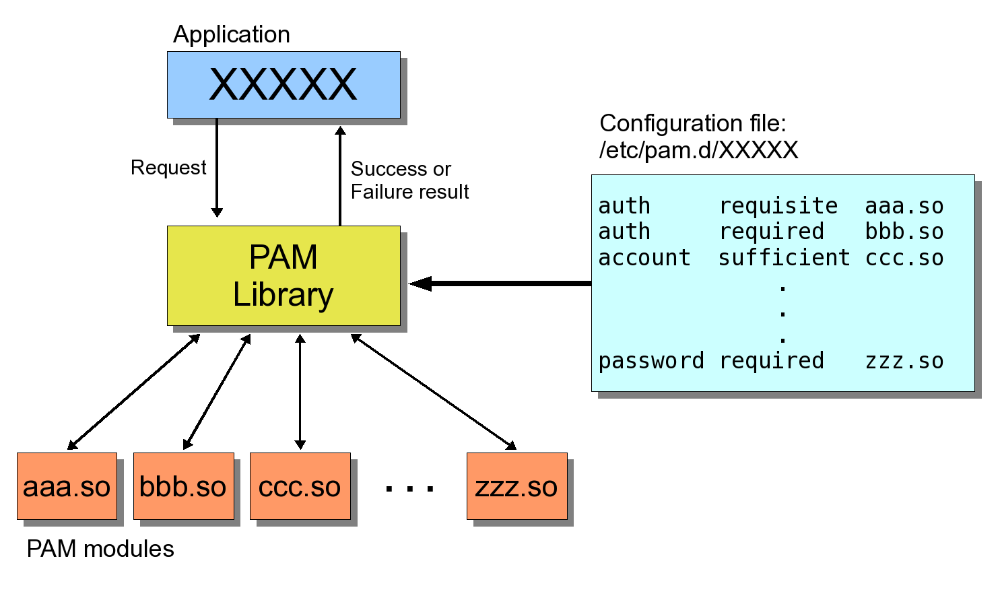

## Linux-PAM

**Linux-PAM** (Pluggable Authentication Modules for Linux), or simply **PAM**, is a suite of shared libraries that handle the authentication tasks of applications (services) on the system.

Why do we need it? Well, historically privilege granting applications (such as [login](login.md), [ssh](ssh.md), [su](su.md)) that require user authentication, has had to be compiled to use a specific authentication mechanism. For example, traditionally, `login` application authenticates users against information stored in [/etc/passwd and /etc/shadow files](user-passwords.md). But, if we wanted to authenticate users against another authentication scheme (e.g. [LDAP](ldap.md), [RADIUS](radius.md), `MySQL`), you would have to recompile the `login` program to support a new authentication system. As you can imagine this is a laborious process which is prone to errors.

It is the purpose of the `Linux-PAM` project to separate the development of privilege granting applications from the development of authentication schemes.

Let's look at the architecture of the PAM framework:



The principal feature of the `PAM` approach is that authentication of PAM-aware applications is dynamically configurable.

This is accomplished by providing a library of functions (**PAM library**) which _acts as an API_ that an application may use to request that a user be authenticated. This PAM library is configured locally with a system file, `/etc/pam.conf` or a series of configuration files located in `/etc/pam.d/` to authenticate a user request via the locally available authentication modules (**PAM modules**). A PAM module can provide user authentication against a specific authenication schema (e.g. locally stored passwords, LDAP, RADIUS, etc.). The modules themselves will usually be located in the directory `/lib/security` or `/lib64/security` and take the form of dynamically loadable object files.

**Summary:** _Linux-PAM enables the local system administrator to choose how PAM-aware applications authenticate users. In other words, without (rewriting and) recompiling the application, it is possible to switch between different authentication schemes._

### PAM configuration

The `/etc/pam.d/` directory contains the PAM configuration files for each PAM-aware application. In earlier versions of PAM, the `/etc/pam.conf` file was used, but this file is now deprecated.

#### Service files

Each PAM-aware application or _service_ has a file in the `/etc/pam.d/` directory. Each file in this directory has the same name as the service it is used for.

For example, you will find a service file for [login](login.md) application, a service file for [su](su.md), [ssh](ssh.md), [sudo](sudo.md), etc.:

```bash
$ ls /etc/pam.d
accountsservice  chpasswd        common-auth      common-session-noninteractive  newusers  polkit-1  su
atd              chsh            common-password  cron                           other     ppp       sudo
chfn             common-account  common-session   login                          passwd    sshd      vmtoolsd
```

The PAM-aware program is responsible for defining its service name and installing its own PAM configuration file in the `/etc/pam.d/` directory. For example, the `login` program defines its service name as login and installs the `/etc/pam.d/login` PAM configuration file.

#### Configuration file syntax

A PAM service file in `/etc/pam.d/` directory is made up of a list of **rules** for how authentication should work for that service. Each rule is typically placed on a single line and has the following format:

```
type control-flags module-path module-arguments
```

Let's briefly describe below what each of these fields mean.

##### type

Linux-PAM separates the tasks of authentication into four independent **management groups**: `account management`; `authentication management`; `password management`; and `session management`. Simply put, these groups take care of different aspects of a typical user authentication.

The **type** is used to specify a management group that this module belongs to.

A module can have more than one function type, so when determining the purpose of a configuration line, always remember to consider the function and module as a pair. For example, the `pam_unix.so` module checks a password when
it's part of the `auth` management group, but it sets a password when it's part of the `password` management group.

Valid entries for the `type` field are:

* `account`: this module type performs non-authentication based account management. It is typically used to check if the user's password expired, restrict/permit access to a service based on the time of day, currently available system resources (maximum number of users).
* `auth` (short for `authentication`): this module type provides two aspects of authenticating the user. First, it establishes that the user is who they claim to be, by instructing the application to prompt the user for a password or other means of identification. Secondly, the module can grant group membership or other privileges through its credential granting properties.
* `password`: this module type is required for updating the authentication token (such as password) associated with the user.
* `session`: this module type is associated with doing things that need to be done for the user before/after they can be given access to service. Such things include mounting directories, displaying a message of the day, etc.

##### control flags

The **control flags** are used to specify the behavior of the _PAM library API_ if the module fails to succeed in its authentication task.

There are two types of syntax for this field:

* the simple one has a single simple keyword;
* the more complicated one involves a square-bracketed selection of value=action pairs.

For the simple (historical) syntax valid control values are:

* `required`: If this rule succeeds, PAM API proceeds to additional rules in the [stack](#rule-stacking). If the rule fails, PAM checks remaining rules in the [stack](#rule-stacking) and always returns authentication failure to the application regardless of the end result of the additional rules.
* `requisite`: If this rule succeeds, PAM API proceeds to additional rules in the [stack](#rule-stacking). If the rule fails, PAM API will immediately return authentication failure to the application and doesn't check any other rules.
* `sufficient`: If this rule succeeds and no prior `required` module has failed, then PAM API returns success to the application immediately without checking any further rules. A failure of a sufficient module is ignored and processing of the PAM module stack continues unaffected.
* `optional`: the success or failure of this module is ignored, unless it is the only module in the [stack](#rule-stacking).
* `include`: If this flag is given, the file specified as argument is inserted at this place. The file is located in `/etc/pam.d` directory.

##### module path

The **module path** is either the full filename of the authentication module or a relative pathname from the default module location which is either `/lib/security/` or `/lib64/security/`, depending on the architecture.

##### module arguments

The PAM library is also capable of taking arguments and passing them to the target module. The module arguments should be specified in the 4th field of the rule. If multiple arguments are needed to be passed, they must be separated by space.

Common examples of module arguments include `debug` (enables debugging) or `nullok` (allows the use of empty passwords).

#### Rule stacking

One important feature of PAM is that the rules can be **stacked**, meaning that you can
apply many rules of the same [type](#type). This is why the [control flags](#control-flags) are important: the success or
failure of one rule can impact following rules or cause the entire function to succeed or fail.

For example, the service file for [chsh](chsh.md) command on my Centos box includes the following rules of the [authentication type](#type):

```bash
$ cat chsh | fgrep 'auth '
auth       sufficient   pam_rootok.so
auth       include      system-auth
```

Note, because this service file also [includes](#type) configuration from the `/etc/pam.d/system-auth` file, we also need to see its contents in order to understand full configuration:

```bash
$ cat system-auth | fgrep 'auth '
auth        required      pam_env.so
auth        required      pam_faildelay.so delay=2000000
auth        sufficient    pam_unix.so nullok try_first_pass
auth        requisite     pam_succeed_if.so uid >= 1000 quiet_success
auth        required      pam_deny.so
```

With this service configuration, when the `chsh` command asks PAM to perform the authentication function, PAM
does the following:

1. `pam_rootok.so` module checks to see if the `root` user is the one trying to authenticate. If so, it
immediately succeeds and attempts no further authentication. This works because the control argument is
set to `sufficient`, meaning that success from this action is good enough for PAM to immediately
report success back to chsh. Otherwise, it proceeds to Step 2.
2. `pam_env.so` loads `/etc/security/pam_env.conf` to set the environment variables as specified in this file. Because the control flag `required` does not cause PAM to fail its authentication immediately, it will run any lines
left on its stack, but the report back to the application will always be of failure.
3. `pam_faildelay.so` module along with its argument `delay=2000000` introduces a minimal delay in case of failure (in microseconds), i.e. will make a user wait prior to being able to enter another password. This replaces the `FAIL_DELAY` setting from [login.defs](user-passwords.md).
4. `pam_unix.so` module asks the user for the user’s password and checks it. The control flag is set
to `sufficient`, which means that if prior `required` steps succeeded, success from this module (a correct password) is enough for PAM to report success to `chsh` command that asked for user authentication. If the password is incorrect, PAM moves onto the next step. The argument `nullok` instructs the `pam_unix.so` module to allow a blank password. And the `try_first_pass` argument makes this module first try the previous stacked module's password in case that satisfies this module as well before prompting the user for their password.
5. `pam_succeed_if.so` is designed to succeed or fail authentication based on characteristics of the account belonging to the user being authenticated. The module is given [one or more conditions](https://linux.die.net/man/8/pam_succeed_if) as module arguments (in this case we test user ID), and authentication will succeed only if all of the conditions are met. In our case, this module is used to decide whether to check the next rules based on a test. If this module succeeds, the next rule will be checked; if it fails, the failure will be immediately returned to `chsh`, because of the `requisite` control flag.
6. `pam_deny.so` module always fails, and because the `required` control flag is set, PAM
reports failure back to `chsh`. This is a default for when there’s nothing left to try.

#### other service file

The `/etc/pam.d/other` service file defines the default configuration for any application that lacks its
own configuration file. The default is often to deny everything:

```bash
$ cat other
#%PAM-1.0
auth     required       pam_deny.so
account  required       pam_deny.so
password required       pam_deny.so
session  required       pam_deny.so
```

### PAM modules

**PAM modules** are a set of shared libraries for a specific authentication mechanism.

Because there are many kinds of authentication scenarios, PAM employs a number of dynamically loadable
authentication modules. Each module performs a specific task; for example, the `pam_unix.so` module can
check a user’s password.

Module reference guide can be found [here](http://www.linux-pam.org/Linux-PAM-html/sag-module-reference.html). Also look for man pages of modules you're interested in.

### Resources used to create this document

* http://www.linux-pam.org/Linux-PAM-html/Linux-PAM_SAG.html
* http://www.linux-pam.org/Linux-PAM-html/sag-overview.html
* https://dzone.com/articles/linux-pam-easy-guide
* https://doc.opensuse.org/documentation/leap/security/html/book.security/cha.pam.html
* https://medium.com/information-and-technology/wtf-is-pam-99a16c80ac57
* https://www.linuxtopia.org/online_books/linux_administrators_security_guide/07_Linux_User_Authentication.html
* https://docs.oracle.com/cd/E19120-01/open.solaris/819-2145/ch3pam-01/index.html
* https://www.ibm.com/developerworks/library/l-pam/index.html
* https://www.centos.org/docs/5/html/Deployment_Guide-en-US/ch-pam.html
* [How Linux Works, 2nd Edition: What Every Superuser Should Know](https://www.amazon.com/How-Linux-Works-2nd-Superuser-ebook/dp/B00PKTGLWM)
* man pam
