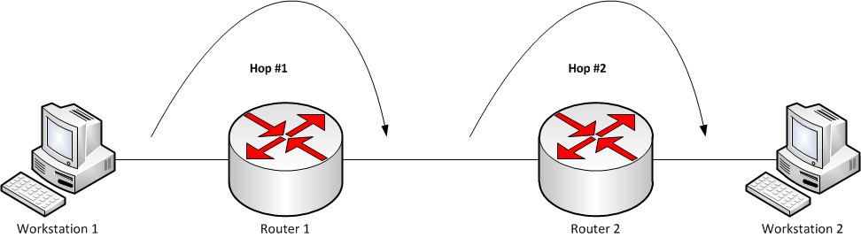

## traceroute

**traceroute** is a handy tool that allows to trace the route the data packets take in order to reach the target network host.

### How does it work?

Every [IP packet](networking-models.md) that you send on the network has a field called as **TTL** (stands for Time To Live).

_`TTL` shows the maximum number of [hops](https://en.wikipedia.org/wiki/Hop_(networking)) that a data packet can go through while travelling to its destination before it's dropped._

Data packets pass through `bridges`, `routers` and `gateways` as they travel between source and destination. Each time packets are passed to the next network device, a **hop** occurs.



Thus, a **hop count** refers to the number of intermediate devices through which data must pass between source and destination.

Each time a `router` receives a packet, it modifies the packet, decrementing the `TTL` value. The router will discard any received packet with a TTL value set to `1` or less. This prevents packets from travelling through _endless loops_ that may occur on the network and helps to avoid the network congestion.

(Note that not all network devices change the `TTL`. For instance, unlike routers, Ethernet hubs and bridges do not change the `TTL` value.)

When a router receives a packet with `TTL` value set to `1`, it decrements the `TTL` value to `0` and discards the packet. But besides dropping the package, the router aslo sends an [ICMP time exceeded error message](https://en.wikipedia.org/wiki/Internet_Control_Message_Protocol#Time_exceeded) back to original sender specified in the source IP address of the received packet. When this time exceeded message is sent by the router, the original sender will know the IP address of the router.

The **traceroute** utility is a clever hack designed to force each router along the path, in turn, to return an error report. It works by setting the `TTL` first to `1` (causing the first router to send an error report back to the source) and then setting it to `2` (causing the next router to send an error report) and so forth until the packet reaches the destination. This allows to learn the IP addresses of all the intermediary devices which packet have to cross on its way to the destination host.

When the packet does reach its destination, the destination host replies to the source with [ICMP destination/port unreachable message](https://en.wikipedia.org/wiki/Internet_Control_Message_Protocol#Destination_unreachable), because the traceroute sends the packet to a random "unlikely" UDP port between `33434` to `33534`. Thus, the `traceroute` will know that the packet has reached its destination.

([see a more detailed description of how traceroute works](https://www.slashroot.in/how-does-traceroute-work-and-examples-using-traceroute-command))

### Protocols matter

`traceroute` sends probe packets over `UDP`, `TCP` or `ICMP` protocol. `traceroute` works slightly differently depending on the protocol, but the overall principle of setting the `TTL` to a small number and awaiting an ICMP time exceeded error message remains the same.

Choosing the protocol is important because routers may block certain ports by firewall, hence using `TCP` on port `80`, an `ICMP` echo request (ping) or `UDP` on port `53` (DNS) might be more likely to succeed than a `UDP` datagram on a random unused port.

By default, `traceroute` sends probe packets over `UDP` with so-called "unlikely" destination ports. The "unlikely" port of the first probe is 33434, then for each next probe it is incremented by one. Since the ports are expected to be unused, the destination host normally returns "icmp unreach port" as a final response.

```bash
$ traceroute -n 8.8.8.8
```

To use `ICMP` protocol, specify the `-I` option:

```bash
$ traceroute -I -n 8.8.8.8
```

This method uses icmp echo packets for probes. Traceroute program will send ICMP Echo Request messages and the hops in between will reply with a ICMP Time exceeded messages. But the final destination will reply with ICMP Echo reply.

To use `TCP` protocol, specify if `-T` flag (if supported) or use the `tcptraceroute` command.

```bash
$ traceroute -T -n google.com
```

This method uses the constant destination port (default is `80`). A well-known "half-open technique" is used in this case, which prevents applications on the destination host from seeing our probes at all. Normally, a tcp syn is sent. For non-listened ports we receive tcp reset, and all is done. For active listening ports we receive tcp syn+ack, but answer by tcp reset (instead of expected tcp ack), this way the remote tcp session is dropped even without the application ever taking notice.

### Command output explanation

The default output of the `traceroute` command looks like this:

```bash
$ traceroute google.com
traceroute to google.com (172.217.25.46), 30 hops max, 60 byte packets
 1  10.8.8.1 (10.8.8.1)  316.212 ms  316.393 ms  317.031 ms
 2  107.181.128.1 (107.181.128.1)  322.328 ms  326.666 ms  326.872 ms
 3  au-sy3-bdr-0-0.as58940.net.au (43.245.167.1)  321.205 ms  326.474 ms  327.065 ms
 4  as15169.nsw.ix.asn.au (218.100.52.3)  327.626 ms  327.762 ms  328.033 ms
 5  216.239.43.157 (216.239.43.157)  328.232 ms 216.239.47.81 (216.239.47.81)  328.427 ms 216.239.43.157 (216.239.43.157)  328.631 ms
 6  108.170.233.193 (108.170.233.193)  328.817 ms 108.170.233.195 (108.170.233.195)  316.259 ms  317.409 ms
 7  syd15s02-in-f14.1e100.net (172.217.25.46)  317.079 ms  321.961 ms  322.113 ms
```

The first line shows the hostname and ip that is to be reached, the maximum number of hops to the host that `traceroute` will attempt and the size of the byte packets to be sent. Then each line lists a hop to get to the destination. The hostname is given, followed by the ip of the hostname, followed by the roudtrip time that it takes for a packet to get to the host and back to the initiating computer (by default `traceroute` sends three packets for each host so three response times are listed).

The following example shows a `traceroute` that fails to reach the destination:

```bash
$ traceroute google.com
traceroute to google.com (172.217.25.46), 30 hops max, 60 byte packets
 1  10.8.8.1 (10.8.8.1)  316.212 ms  316.393 ms  317.031 ms
 2  107.181.128.1 (107.181.128.1)  322.328 ms  326.666 ms  326.872 ms
 3  au-sy3-bdr-0-0.as58940.net.au (43.245.167.1)  321.205 ms  326.474 ms  327.065 ms
 4 * * *
 5 * * *
 6 * * *
 7 * * *
...
```

In this example the asterisks show packet loss. This could mean a network outage, high amounts of traffic leading to network congestion or a firewall dropping traffic.

### Useful command options

#### Specify a port

If some filters are present in the network path, then most probably any "unlikely" `UDP` ports (as for default method) or even icmp echoes (as for icmp) are filtered, and whole tracerouting will just stop at such a firewall.  To bypass a network filter, we have to use only allowed protocol/port combinations. To specify a port, use the **-p** option:

```bash
$ traceroute -T -p 443 -n google.com
```

#### Show only IP addresses

Use the **-n** option to show only IP addresses of the hosts instead of their hostnames:

```bash
$ traceroute -n 8.8.8.8
```

### Resources used to create this document:

* https://www.slashroot.in/how-does-traceroute-work-and-examples-using-traceroute-command
* https://en.wikipedia.org/wiki/Hop_(networking)
* https://www.perl.com/article/how-does-traceroute-work-/
* https://www.systutorials.com/docs/linux/man/1-traceroute/
* https://shapeshed.com/unix-traceroute/
